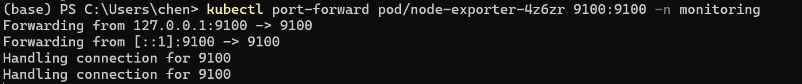

# 南开大学软件工程 软件测试与维护大作业
## 小组成员
 `石彬辰 2213409`
 `高文康 2113691`
 `张婧怡 2213554`
 `蔚佳明 2210727`
 `陈雨佳 2210849`
## 选择论文 
[Online-Boutique/Multivariate Time Serier AD/KDD20-USAD](./docs/KDD20-USAD.pdf)

源码地址 [USAD](https://github.com/manigalati/usad)
## 选择微服务系统 
原址  [Online-Boutique ](https://github.com/JoinFyc/Online-Boutique)
## 实验过程(简)
### `docker`部署 [Online-Boutique](./Online-Boutique/)

创建命名空间 final

在 final 命名空间下创建服务节点

所有节点正常运行

运行服务

服务网页正常

### `docker`部署`Chaos-Mesh`

运行 `kubectl port-forward -n chaos-testing svc/chaos-dashboard 2333:2333`

按要求编写并运行 [rbac.yaml](./chaosMesh/rbac.yaml) 并生成 `token`

绑定 `token`

### [Selenium](./Online-Boutique_test/selenium_test.py) 测试微服务
[selenium 测试录屏](./docs/assets/Selenium_test.mp4)
### [Jmeter](./Online-Boutique_test/test.jmx) 测试微服务
[测试报告](./Online-Boutique_test/report-output/index.html)

### `docker`部署 [Prometheus + grafana](./manifests-monitoring/)

#### 运行 `kubectl port-forward pod/node-exporter-4z6zr 9100:9100 -n monitoring` 暴露 `node-exporte` 的 `9100` 端口到集群外部

### 正常状态数据生成
#### 多线程运行 [Jmetet测试](./Online-Boutique_test/test.jmx) 用作模拟用户访问 [Online-Boutique](./Online-Boutique/) 微服务
#### 编写并运行 [集群指标抓取脚本](./data/prometheus_log.py) 生成包含集群各项指标的 .txt 文件
#### 编写并运行 [集群指标预处理脚本](./data/data_csv_1.py) 将.txt 内的数据处理为 .csv文件
#### 编写并运行 [集群状态标记脚本](./data/data_label_2.py) 标记当前数据为 `Normal`
#### 编写并运行 [数据清洗脚本](./data/data_clean_3.py) 清洗无关数据,运算并保留以下数据

`other_cols = ['window_start', 'window_end', 'Normal/Attack']`

`load_cols = [col for col in df.columns if 'node_load' in col]`

`keep_cols = other_cols + load_cols + [
    'cpu_util', 'mem_util',
    'disk_read_mbps', 'disk_write_mbps',
    'net_rx_mbps', 'net_tx_mbps',
    'fs_util'
]`

#### 获得 `normal0.csv`
### 异常状态数据生成
#### 编写 [故障脚本](./chaosMesh/pod-kill.yaml) 使得随机向 `final`(`Online-Boutique` 运行的位置) 命名空间的 `pod` 注入故障
#### 编写并运行 [故障注入脚本](./chaosMesh/pod_kill.py) 每1~2s进行故障注入
#### 多线程运行 [Jmetet测试](./Online-Boutique_test/test.jmx) 用作模拟用户访问 [Online-Boutique](./Online-Boutique/) 微服务
#### 运行 [集群指标抓取脚本](./data/prometheus_log.py) 生成包含集群各项指标的 .txt 文件
#### 运行 [集群指标预处理脚本](./data/data_csv_1.py) 将.txt 内的数据处理为 .csv文件
#### 运行 [集群状态标记脚本](./data/data_label_2.py) 标记当前数据为 `Attack`
#### 运行 [数据清洗脚本](./data/data_clean_3.py) 清洗无关数据,运算并保留以下数据
`
other_cols = ['window_start', 'window_end', 'Normal/Attack']
load_cols = [col for col in df.columns if 'node_load' in col]
keep_cols = other_cols + load_cols + [
    'cpu_util', 'mem_util',
    'disk_read_mbps', 'disk_write_mbps',
    'net_rx_mbps', 'net_tx_mbps',
    'fs_util'
]
`
#### 添加少量 `Normal` 数据到异常状态数据中
#### 获得 `attack0.csv`
### 本地配置 USAD 的运行环境
运行 `git clone https://github.com/manigalati/usad.git`

运行 `pip install -r requirtments.txt` 下载[依赖](requirements.txt)

### 修改 [USAD.ipynb](./usad/USAD.ipynb) Attack数据为 [attack0.csv](./usad/input/attack0.csv) , Normal数据为 [normal0.csv](./usad/input/normal0.csv)
### `jupyter notebook` 下运行 [USAD.ipynb](./usad/USAD.ipynb) 获得以下结果
`损失率变化图像`:

`准确率变化图像`

[模型文件](./usad/model.pth)
### [usad](./usad/)目录下的 [数据加载](./usad/load_data.py) , [训练](./usad/train.py) , [测试](./usad/test.py) 文件为 [USAD.ipynb](./usad/USAD.ipynb) 拆分修改而来

